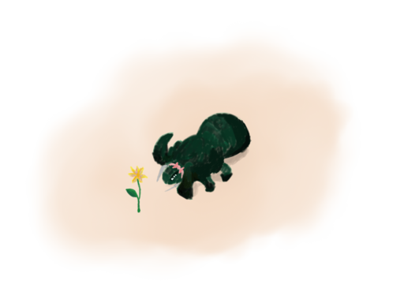

Urcheon
=======


  
_My lovely granger needs a tender knight to care for his little flower._

Description
-----------

This is a toolset to manage and build `pk3` or `dpk` source directories.

This toolset focus on [Unvanquished](http://unvanquished.net) game support, but many things were thought to be extended.

This toolset was initially developed for the [Interstellar Oasis](https://github.com/interstellar-oasis/interstellar-oasis) initiative.

Shipped with Urcheon is the Esquirel tool, this is a toolset to modify `.map` and `.bsp` files. Esquirel is a bit id Tech 3 centric at this time. It works well for Unvanquished at this time and probably with many other games using id Tech 3 map and bsp format.

_Urcheon is the Middle English term for “hedgehog”, used to refer the related ordinary in heraldry._

_Esquirel is the Englo-Norman word for “squirrel”, from the Old French “escurel” who displaced Middle English “aquerne”._


Urcheon help
------------

This is where the beast comes. This tool handles assets in repository, to prepare them (sloth-driven shader generation), build them (asset compression, bspdir merge, map compilation), then package them. Each file type (lightmap, skybox, texture, model…) is recognized thanks to some profiles you can extend or modify, picking the optimal compression format for each type. If needed, you can write explicit rules for some specific files to force some format or blacklist some files. The Urcheon tool becomes more powerful when used in git-tracked asset repositories: it can build partial package given any given git reference (to build a package that contains only things since last release tag for example), and it can automatically computes the package version using tags, commits date, and commit id. It allows to define per-map compilation profile. The asset conversion and compression pass is parallelized to speed-up the process.

Urcheon offers multiple stage.


### The `discover` stage

This is an optional and not recommended stage if you want to not rely on automatic action list. This stage produces your action lists, do not forget to use `-n` or `--no-auto ` options on `prepare` and `build` stages later!

In most case, you don't need it. If you need it, it means you have to fix or extend file detection profiles.

This stage is not recommended since it will add so much noise to your git history each time you add or remove files.


### The `prepare` stage

This is an optional stage to prepare your source directory, it is needed when you have to produce files to feed your map editor or your map compiler, like shader files or preview textures. If your texture package is `sloth` driven, you must define a `slothdir` file per texture set and use the `prepare` stage.

If you need to prepare your source, always call this stage before the `build` one.


### The `build` stage

This stage is required, it produces for you a testable pakdir with final formats: compressed textures, compiled map etc. If your assets are tracked in a Git repository, you can a build partial pakdir using the `-r` or `--reference` options plus an arbitrary past Git reference (tag, commit…)

You can set a `PAKPATH` environment variable to declare multiple directories containing other pakdir, it's needed if your package relies on other ones. The format is like the good old `PATH` environment variable: _pathes separated with colons_.

If you're building a partial `dpk` package, an extra entry containing your previous package version is added to `DEPS` file automatically.

You must call this stage before the `package` one.


### The `package` stage

This stage produces a pak file from your previously built pakdir and your game supports `dpk` format. Urcheon automatically writes the version string of the produced pak and automatically rewrites your `DEPS` file with version from other pakdir in `PAKPATH`.


### The `clean` stage

This stage is convenient to clean stuff, it has multiple options if you don't want to clean-up everything.


### Example:

Having this `.pakinfo/pak.conf` file in your repository:

```
[config]
name = "map-name"
version = "@ref"
game = "unvanquished"
```

Running these commands:

```
urcheon clean
urcheon prepare
urcheon build --reference v2.1 --map-profile final
urcheon package

```

These `urcheon` calls clean the previous build, compute build rules (named _actions_) using the `unvanquished` profile, build your source tree since tag `v2.1`, compile the map using a predefined `final` stage, then package the whole as `map-name_2.1+timestamp~sha1.pk3` because there was some modifications since `v2.1`, otherwise the package would be named `map-name_2.1.pk3`.

Type `urcheon <stage> --help` from some help.


### Dependencies

These are the Python3 modules you will need to run `urcheon`: `argparse`, `fnmatch`, `glob`, `logging`, `multiprocessing`, `operator`, `os`, `pytoml`, `re`, `shutil`, `struct`, `subprocess`, `sys`, `tempfile`, `threading`, `toml`, and `zipfile`. Currently there is two [TOML](https://github.com/toml-lang/toml) modules used: [`toml`](https://github.com/uiri/toml) and [`pytoml`](https://github.com/avakar/pytoml), the `pytoml` one is the prefered one since its TOML support is perfect and this module gives better debugging messages, badly, it does not support ordered dictionary yet and that's needed for the map compilation handling (you must be able to define your bsp compilation stage before the lightmap one etc.) that's why `toml` is used to workaround that `pytoml` limitation in this only place. Once `pytoml` get ordered dictionnary support, `toml` will be ditched.

The `urcheon` tool relies on:

- [`q3map2` from netradiant](https://gitlab.com/xonotic/netradiant), the one maintained by the Xonotic team, to compile maps (the one from GtkRadiant is lacking required features);
- [`daemonmap`](https://github.com/Unvanquished/daemonmap) if you want to generate Unvanquished navmeshes;
- [Sloth](https://github.com/Unvanquished/Sloth) if you need it to generate shader files;
- [`convert` from ImageMagick](https://www.imagemagick.org/) to convert from and to various image formats;
- [`cwebp` from Google](https://developers.google.com/speed/webp/docs/cwebp) to convert images to webp format;
- [`crunch` from Unvanquished](https://github.com/Unvanquished/crunch) to convert images to crn format (the one from BinomialLLC or the one from Unity are lacking required features);
- [`opusenc` from Xiph](http://opus-codec.org) to convert sound files to opus format;
- [`iqm` from FTE QuakeWorld](https://sourceforge.net/p/fteqw/code/HEAD/tree/trunk/iqm/) to convert iqe models (the one from Sauerbraten is lacking required features).

To summarize:

* Python3 modules: `argparse fnmatch glob logging multiprocessing operator os pytoml re shutil struct subprocess sys tempfile threading toml zipfile`
* Third party tools: `convert crunch cwebp daemonmap iqm opusenc q3map2 sloth.py`


Esquirel help
-------------

Like Urcheon, Esquirel offers multiple stages.

### The `map` stage

It allows to parse some maps (id Tech 3 format only supported at this time): de-numberize them for better diff, export entities as seen in bsp, or substitutes entities using some substitution list you can write yourself.

Example:

```
esquirel map --input-map file.map \
	--substitute-entities substitution.csv \
	--disable-numbering \
	--output-map file.map
```

This `esquirel` call updates obsolete entities keywords using the `substitution.csv` list, disabling the entity numbering to make later diffing easier.

Type `esquirel map --help` for some help.


### The `bsp` stage

It allows to edit some bsp (id Tech 3 format only supported at this time): import/export texture lists (this way you can rename them or tweak their surface flags), import/export entities, import/export lightmaps (this way you can repaint them by hand or use them as compressed external instead of internal one), or print some statistics. The best part in the `bsp` stage is the ability to convert a `bsp` to a `bspdir` that contains one file per lump, and some of them are stored in editable text format. These `bspdir` are mergeable back in a new `bsp`, allowing many modification or fixes to maps you lost source. It allows easy maintenance or port to other games.

Example:

```
esquirel bsp --input-bsp file.bsp \
	--list-lumps \
	--output-bspdir directory.bspdir
```

This `esquirel` call converts a `bsp` file to a `bspdir` directory, printing some lump statistics at the same time.

Type `esquirel bsp --help` for some help.


Warning
-------

No warranty is given, use this at your own risk. It can make you awesome in space if used inconsiderately.


Author
------

Thomas Debesse <dev@illwieckz.net>


Copyright
---------

This toolbox is distributed under the highly permissive and laconic [ISC License](COPYING.md).
